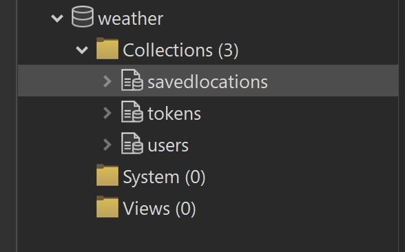

# Weather App with TypeScript, React, Node.js/Express, MongoDB/Mongoose and Tailwind

## A fully functional Weather App with a registration form so you can create your own account, find weather forecast in every corner of the world and save your favorite locations to check them up later

This is my first project using **Tailwind** and **third party API**

### Check the demo version: https://dashboard.render.com/static/srv-cpala8dds78s73d3m7a0

This fully functional Weather App lets you:

-   **_on front-end:_**

    -   create your own account
    -   check weather detailed forecast anywhere in the world
    -   save locations to your favorite
    -   show your location on the map
    -   log-in/log-out

-   **_on back-end:_**

    -   create this user in the database (I used Studio 3T as a MongoDB GUI)
    -   create a token for security that is saved both in Session storage and in the database
    -   create and delete locations from database
        
    -   provide log-in/log-out logic

APIs I used:

-   https://geocode.xyz/ for reverse geocoding
-   https://geocoding-api.open-meteo.com/ for forward geocoding
-   https://air-quality-api.open-meteo.com/ for air quality
-   https://api.open-meteo.com/ for weather forecast

As an inspiration for my app I used a design by:
    <a href="https://www.figma.com/community/file/1100826294536456295/weather-app-ui-design">'https://www.figma.com/community/file/1100826294536456295/weather-app-ui-design'</a>

## Running backend

### `npm start`

Runs the app in the development mode.\
Open [http://localhost:3000](http://localhost:3000) to view it in your browser.

The page will reload when you make changes.\
You may also see any lint errors in the console.

## Running frontend

### `npm run dev`

Runs the app in the development mode.
Open [http://localhost:5173](http://localhost:5173) to view it in your browser

The page will reload when you make changes.\
You may also see any lint errors in the console.

### `npm run tailwind`

Runs Tailwind CLI

### `npm run build`

Builds the app for production to the `build` dist.\
It correctly bundles React in production mode and optimizes the build for the best performance.

The build is minified and the filenames include the hashes.\
Your app is ready to be deployed!

See the section about [deployment](https://facebook.github.io/create-react-app/docs/deployment) for more information.
